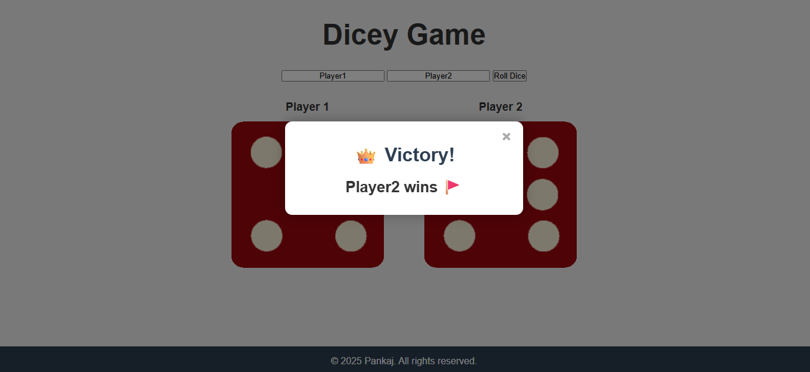

# 🎲 Dice Game – Capstone Project

A fun, interactive dice game built using **HTML, CSS, and JavaScript**. This project simulates a two-player dice game where users can enter their names, roll the dice, and see a dynamic modal popup declaring the winner!

## 🌟 Features

- 🎮 Two-player mode with custom name inputs  
- 🎲 Random dice rolls for each player  
- 🏆 Popup modal displays the result dynamically  
- 💻 Responsive and clean UI design  
- 🎨 Smooth animations and stylish layout  
- 🧑‍💻 Beginner-friendly JavaScript logic with DOM manipulation  

## 📸 Preview

Here are screenshots of the game in action:




## 🚀 Getting Started

To play the game locally:

```bash
git clone https://github.com/Pankaj4532/dice-game.git
cd dice-game
```

Then open `index.html` in your browser.

## 🛠️ Technologies Used

- **HTML5** – Structure  
- **CSS3** – Styling and layout  
- **JavaScript** – Game logic and interactivity  

## 📁 Project Structure

```
📦 dice-game
├── index.html
├── styles.css
├── index.js
└── images/
    ├── dice1.png
    ├── dice2.png
    ├── ...
    └── dice6.png
```

## 📌 Capstone Objective

This project demonstrates the following skills:

- DOM manipulation
- Event handling
- Modal window implementation
- Dynamic user interaction using JavaScript

## 🙌 Author

**Pankaj Sapkal**  
© 2025 Pankaj. All rights reserved.

## 📃 License

This project is licensed under the MIT License – feel free to use and modify it.
